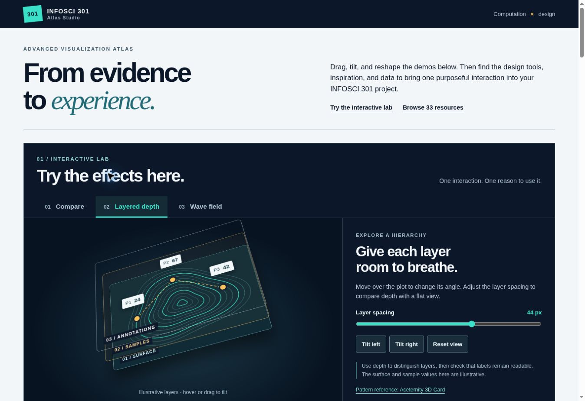

# INFOSCI 301 · Advanced Visualization Atlas

A static, searchable collection of AI design skills, motion and interaction galleries, direct live effects, and data sources for INFOSCI 301. Each resource has a short introduction, an official link, a page preview, and a class exercise prompt.

This atlas is the **advanced visualization reference** in the course pathway. It is separate from the [basic idioms gallery](https://huggingface.co/spaces/dku-infosci301-Autumn2026/week2-visualization-gallery-template) and the course's network, spatial/spatiotemporal, and interactive visualization tutorials. Three demonstrations run directly on the page, with **Try here** links from the relevant collection cards. The catalog also retains links to the original examples.

## On-page interactive lab

[Open the interactive lab](https://infosci301-advanced-visualization-a.vercel.app/#effect-lab)

- **Compare:** drag the divider across two synthetic spatial heatmaps. A native range control supports keyboard use; both scenarios use the same grid, extent, and 0–100 color scale. Inspired by [Aceternity Compare](https://ui.aceternity.com/components/compare).
- **Layered depth:** rotate a CSS 3D diagram with pointer movement or buttons, and change the distance between its synthetic surface, sample, and annotation layers. Inspired by [Aceternity 3D Card](https://ui.aceternity.com/components/3d-card-effect).
- **Wave field:** interact with an animated canvas and adjust amplitude and speed. Pause/play is available; animation starts paused when reduced motion is requested, and stops when hidden or off screen. Inspired by [React Bits Waves](https://reactbits.dev/c/backgrounds/waves).

These are original dependency-free classroom implementations of the interaction patterns, not embedded third-party pages or copied component code. All plotted values are explicitly labeled synthetic or illustrative. The wave field is decorative, not a physical model. The lab's behavior and styles live in `effects.js` and `effects.css`.

## Deploy with Vercel Git integration

1. In Vercel, choose **Add New → Project** and import this GitHub repository.
2. Select **Other** as the framework. Leave the **Build Command** blank and use `.` as the **Output Directory**. The repository root already contains `index.html`; there is no install or build step.
3. Deploy. Later commits to the connected production branch create new deployments.

For a local preview, run `python3 -m http.server 8000` from the repository root and open `http://localhost:8000`.

## Edit the collection

- Add or revise entries in `data.js`. Categories are `skills`, `gallery`, and `data`; set `live: true` for a direct interactive example.
- Save a corresponding `previews/<id>.jpg` image. Use `previewOf` when the screenshot shows an official companion page rather than the linked destination.
- `demoUrl` adds a direct example link to a broader collection card. `previewUrl` adds a secondary source or tutorial link.
- The page, filtering, and card rendering are in `index.html`, `main.js`, and `style.css`.

Resource names, screenshots, demos, and linked code belong to their respective creators. Consult each source for licenses, usage terms, and data access. The new live-effect screenshots were captured on 29 September 2026; some graphics-intensive demos may require a capable browser and GPU.
